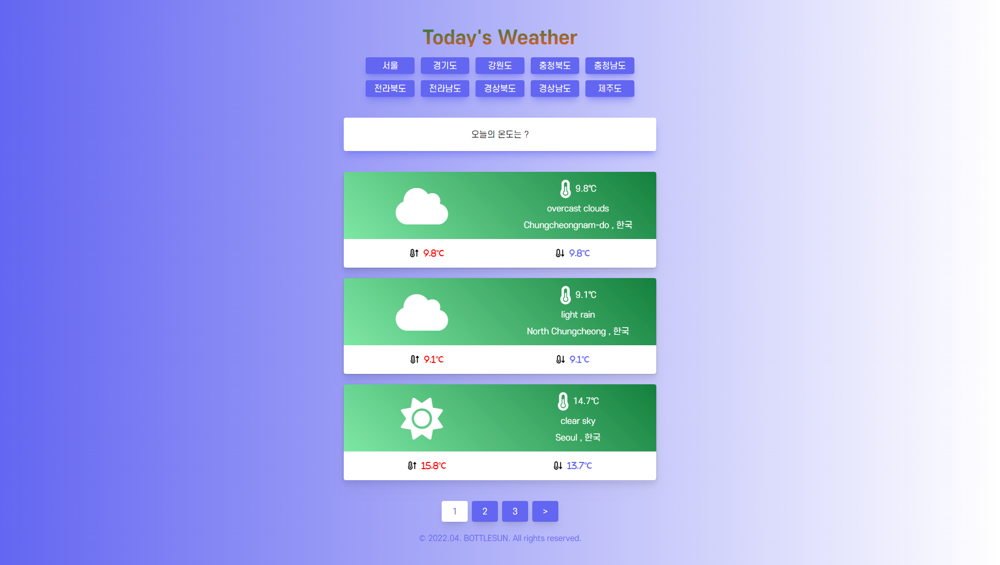

# Today's Weather 

## [ WeatherAPI WebSite ]

API를 활용하여 날씨 페이지 구성하기

* Demo App - https://bottlesun.github.io/study/06-Weather/

## ●기능
* https://openweathermap.org/api API 활용하여 날씨 페이지 구현
* 버튼 클릭시 해당 지역 날씨 표시 기능 구현
* 페이지네이션 기능 구현
* 오류 발견 시 화면단에 오류 내용 출력
* 날씨 온도에 따라 색 변경 기능 구현
* 반응형 홈페이지 구현

## ●Skill
* HTML
* CSS
* JavaScript