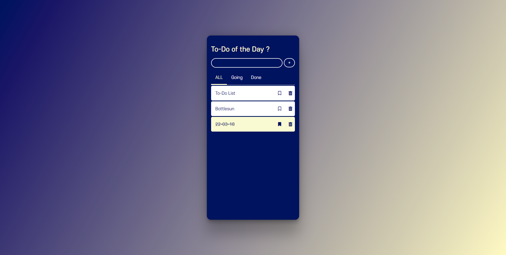

# JSstudy/TodoList

## [ To-do List APP ]

아이템 추가 제거, 상태별 할 일을 볼 수 있는 APP 형태로 제작 진행

* Demo App - https://bottlesun.github.io/study/JSstudy/TodoList/

## ●기능
* 할일 추가 기능
* 각 할일에 삭제 및 체크 기능
* 삭제 버튼 클릭 시 할일 리스트에서 삭제
* 체크 버튼 클릭 시 완료 상태로 간주하고 밑줄 처리
* 완료 상태의 할일은 한번 더 버튼 클릭 시 다시 되돌리기 가능
* 탭을 활용해 아이템들을 상태별로 나누어 볼 수 있다.
* 모바일 버전에서도 확인 가능하다. (모바일 UI의 반응형 APP / 웹)

## ●Skill
* HTML
* CSS
* JavaScript